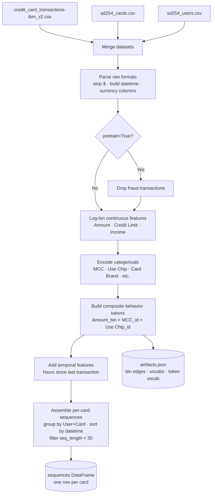
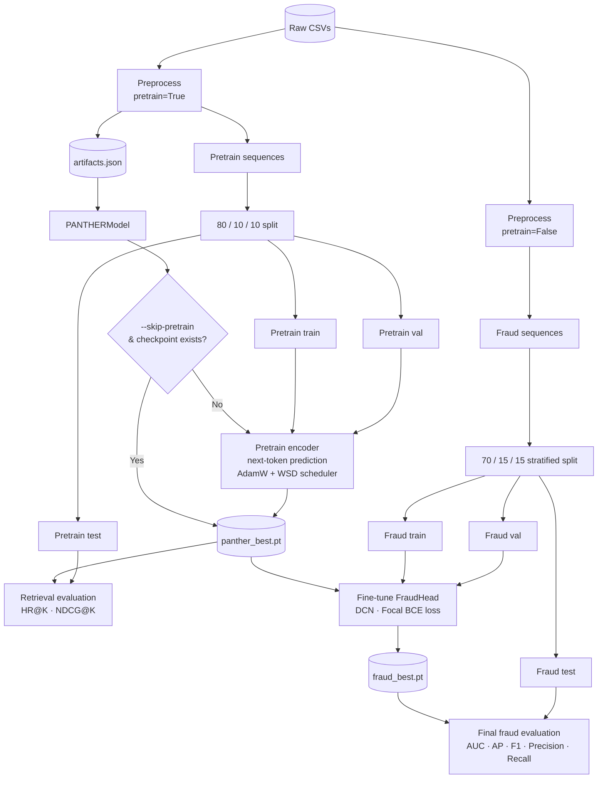

# Arpeggio

Fraud detection on sequential credit card transaction data, based on the [PANTHER](https://arxiv.org/html/2510.10102v2) architecture.

## Setup

```bash
uv sync
```

## Data

Download the [IBM credit card transactions dataset](https://www.kaggle.com/datasets/ealtman2019/credit-card-transactions) and place the CSVs in the `data/` directory, or use the provided script:

```bash
bash download_data.sh
unzip data/credit-card-transactions.zip -d data/
```

## Preprocessing



**Figure 1:** The three raw CSVs are merged and parsed, optionally filtered to remove fraud transactions for self-supervised pretraining, then continuous features are log-binned, categoricals are integer-encoded, and each unique (Amount bin, MCC, Use Chip) combination is assigned a composite token ID. Transactions are grouped into per-card chronological sequences and cards with fewer than 30 transactions are dropped.

Run the end-to-end preprocessing pipeline from Python:

```python
from src.preprocessing import preprocess, save_artifacts

# For downstream fraud detection (keeps fraud transactions)
sequences, artifacts = preprocess("data/")

# For self-supervised pretraining (drops fraud transactions)
sequences, artifacts = preprocess("data/", pretrain=True)

# Persist encoding artifacts for inference-time reuse
save_artifacts(artifacts, "data/artifacts.json")
```

`sequences` is a DataFrame with one row per card containing:
- `beh_seq` — list of composite behavior token IDs `(Amount_bin, MCC, Use Chip)`
- `timestamps` — list of transaction datetimes
- `fraud_labels` — list of per-transaction fraud flags
- `seq_length` — number of transactions in the sequence

Cards with fewer than 30 transactions are excluded by default. Override with `min_seq_length`:

```python
sequences, artifacts = preprocess("data/", min_seq_length=10)
```

## Running the full pipeline



**Figure 2:** The pipeline runs in two stages. First, the data is preprocessed twice: once with `pretrain=True` (fraud transactions removed) to train the encoder as a self-supervised next-token predictor — teaching it what a "normal" transaction sequence looks like — and once with `pretrain=False` (all transactions kept) for the downstream fraud task. The pretrained encoder is then frozen and a Deep & Cross Network head is fine-tuned on top to classify whether the final transaction in each card's history is fraudulent. Keeping the two stages separate means the encoder learns general behavioural patterns before being exposed to any fraud signal.

The simplest way to run everything end-to-end is via `main.py`:

```bash
uv run python main.py
```

This runs preprocessing, pretraining, retrieval evaluation, fraud fine-tuning, and final fraud evaluation in sequence, saving checkpoints to `checkpoints/`.

All splits are card-level — no card appears in more than one partition.

| Task | Train | Val | Test |
|---|---|---|---|
| Pretraining | 80% | 10% | 10% |
| Fraud detection | 70% | 15% | 15% |

Fraud splits are stratified by whether a card has any fraudulent transaction. The val set is used only for early stopping and checkpoint selection; final metrics are always reported on the held-out test set.

Available options:

```
--data-dir          Directory containing raw CSVs (default: data/)
--checkpoint-dir    Model checkpoint directory (default: checkpoints/)
--min-seq-length    Minimum transactions per card (default: 30)
--max-seq-length    Sequence truncation length (default: 512)
--pretrain-epochs   Pretraining epochs (default: 10)
--fraud-epochs      Fraud fine-tuning epochs (default: 5)
--batch-size        Batch size (default: 128)
--learning-rate     Peak learning rate (default: 1e-3)
--freeze-encoder    Freeze encoder during fraud fine-tuning (default: true)
--skip-pretrain     Skip pretraining and load existing checkpoint instead
```

To skip pretraining after the first run:

```bash
uv run python main.py --skip-pretrain
```

## Training

### 1. Pretrain the encoder

Self-supervised next-token prediction on fraud-free transaction histories:

```python
from torch.utils.data import DataLoader, random_split
from src.preprocessing import preprocess, save_artifacts
from src.dataset import TransactionDataset
from src.model import build_model_from_artifacts
from src.train import pretrain

sequences, artifacts = preprocess("data/", pretrain=True)
save_artifacts(artifacts, "data/artifacts.json")

train_size = int(0.9 * len(sequences))
train_seq, val_seq = random_split(sequences, [train_size, len(sequences) - train_size])

train_loader = DataLoader(TransactionDataset(sequences.iloc[train_seq.indices]), batch_size=128, shuffle=True)
val_loader   = DataLoader(TransactionDataset(sequences.iloc[val_seq.indices]),   batch_size=128)

model = build_model_from_artifacts(artifacts)
epoch_losses = pretrain(
    model,
    train_loader,
    val_loader,
    num_epochs=10,
    checkpoint_dir="checkpoints/pretrain",
)
```

Key hyperparameters (all have defaults matching the paper):

| Parameter | Default | Description |
|---|---|---|
| `num_epochs` | 10 | Training epochs |
| `learning_rate` | 1e-3 | Peak LR for AdamW |
| `warmup_steps` | 1 000 | Linear LR warm-up |
| `stable_steps` | 8 000 | Constant LR phase |
| `decay_steps` | 1 000 | Linear LR decay to 10% |
| `grad_clip` | 0.1 | Gradient norm clipping |

### 2. Fine-tune for fraud detection

Train a Deep & Cross Network head on top of the pretrained encoder:

```python
import torch
from torch.utils.data import DataLoader
from sklearn.model_selection import train_test_split
from src.preprocessing import preprocess
from src.dataset import FraudDataset
from src.model import FraudHead, build_model_from_artifacts
from src.train import finetune_fraud

sequences, artifacts = preprocess("data/", pretrain=False)

train_seq, val_seq = train_test_split(sequences, test_size=0.2, random_state=42)
train_loader = DataLoader(FraudDataset(train_seq.reset_index(drop=True)), batch_size=128, shuffle=True)
val_loader   = DataLoader(FraudDataset(val_seq.reset_index(drop=True)),   batch_size=128)

# Load pretrained encoder
model = build_model_from_artifacts(artifacts)
model.load_state_dict(torch.load("checkpoints/pretrain/panther_best.pt"))

fraud_head = FraudHead(input_dim=model.emb_dim + model._item_emb_dim)

history = finetune_fraud(
    model,
    fraud_head,
    train_loader,
    val_loader,
    num_epochs=5,
    freeze_encoder=True,       # set False to fine-tune the full model
    checkpoint_dir="checkpoints/fraud",
)
```

## Evaluation

### Retrieval metrics (pretraining)

HR@K and NDCG@K measure how often the ground-truth next transaction appears in the top-K predictions:

```python
from src.train import evaluate_retrieval

metrics = evaluate_retrieval(model, val_loader, top_k=(1, 10, 100))
# {"hr@1": ..., "hr@10": ..., "hr@100": ..., "ndcg@1": ..., ...}
```

### Fraud detection metrics

AUC-ROC, average precision, F1, precision, and recall at a 0.5 threshold:

```python
from src.train import evaluate_fraud

metrics = evaluate_fraud(model, fraud_head, val_loader)
# {"auc": ..., "average_precision": ..., "f1": ..., "precision": ..., "recall": ...}
```

## Testing

```bash
uv run pytest tests/
```
